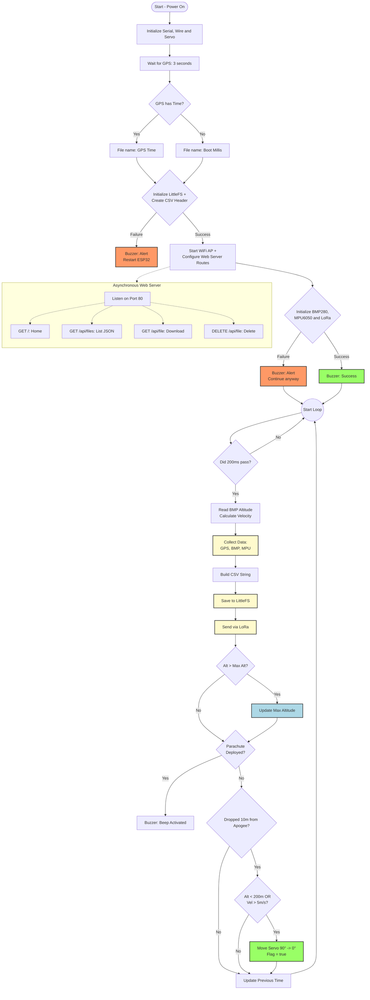

```mermaid
graph TD
    %% Styles
    classDef error fill:#f96,stroke:#333,stroke-width:2px;
    classDef success fill:#9f6,stroke:#333,stroke-width:2px;
    classDef logic fill:#add8e6,stroke:#333,stroke-width:2px;
    classDef io fill:#fffacd,stroke:#333,stroke-width:2px;

    Start([Start - Power On]) --> InitBasic[Initialize Serial, Wire and Servo]
    InitBasic --> GPSWait[Wait for GPS: 3 seconds]

    %% File Definition Block
    GPSWait --> GPSTime{GPS has Time?}
    GPSTime -- Yes --> NameTime[File name: GPS Time]
    GPSTime -- No --> NameMillis[File name: Boot Millis]
    NameTime --> SetupFS
    NameMillis --> SetupFS

    %% File System Block
    SetupFS{Initialize LittleFS +<br>Create CSV Header}
    SetupFS -- Failure --> FSError[Buzzer: Alert<br>Restart ESP32]:::error
    SetupFS -- Success --> StartWiFi[Start WiFi AP +<br>Configure Web Server Routes]

    %% Sensors and LoRa Block
    StartWiFi --> InitMods{Initialize BMP280,<br>MPU6050 and LoRa}
    InitMods -- Failure --> ModError[Buzzer: Alert<br>Continue anyway]:::error
    InitMods -- Success --> ModOk[Buzzer: Success]:::success

    %% Transition to Loop
    ModError --> LoopStart((Start Loop))
    ModOk --> LoopStart

    %% Asynchronous Processes (Server)
    subgraph AsyncServer [Asynchronous Web Server]
        direction TB
        Listen[Listen on Port 80]
        Route1[GET /: Home]
        Route2[GET /api/files: List JSON]
        Route3[GET /api/file: Download]
        Route4[DELETE /api/file: Delete]
        Listen -.-> Route1 & Route2 & Route3 & Route4
    end
    StartWiFi -.-> AsyncServer

    %% Main Loop
    LoopStart --> TimerCheck{Did 200ms pass?}
    TimerCheck -- No --> LoopStart
    TimerCheck -- Yes --> ReadSensors[Read BMP Altitude<br>Calculate Velocity]

    %% Collection and Logging
    ReadSensors --> GetData[Collect Data:<br>GPS, BMP, MPU]:::io
    GetData --> BuildStr[Build CSV String]
    BuildStr --> LogDisk[Save to LittleFS]:::io
    LogDisk --> SendLoRa[Send via LoRa]:::io

    %% Apogee Logic
    SendLoRa --> CheckApogee{Alt > Max Alt?}
    CheckApogee -- Yes --> UpdateMax[Update Max Altitude]:::logic
    CheckApogee -- No --> CheckParachute

    %% Parachute Logic
    UpdateMax --> CheckParachute{Parachute<br>Deployed?}
    CheckParachute -- Yes --> Beep[Buzzer: Beep Activated]
    CheckParachute -- No --> DropCond{Dropped 10m from Apogee?}

    DropCond -- No --> UpdateTimer
    DropCond -- Yes --> SafeCond{Alt < 200m OR<br>Vel > 5m/s?}

    SafeCond -- No --> UpdateTimer
    SafeCond -- Yes --> Deploy[Move Servo 90° -> 0°<br>Flag = true]:::success
    Deploy --> UpdateTimer[Update Previous Time]
    UpdateTimer --> LoopStart

```
